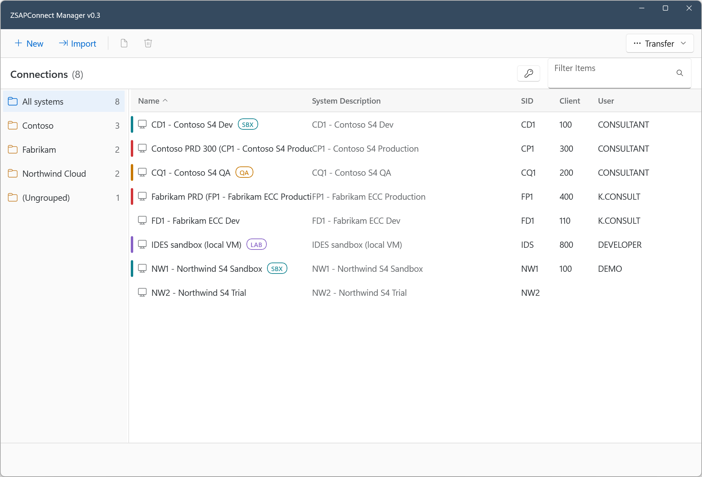
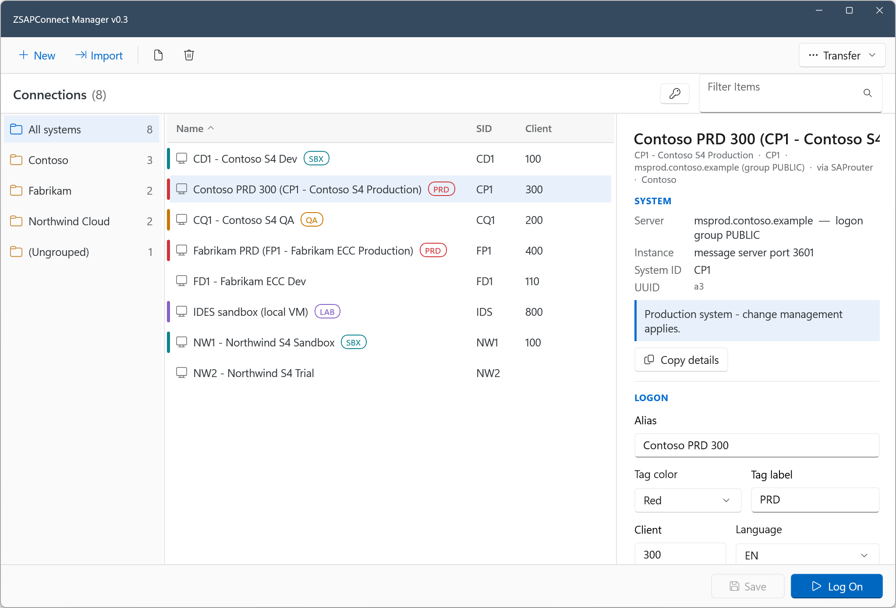
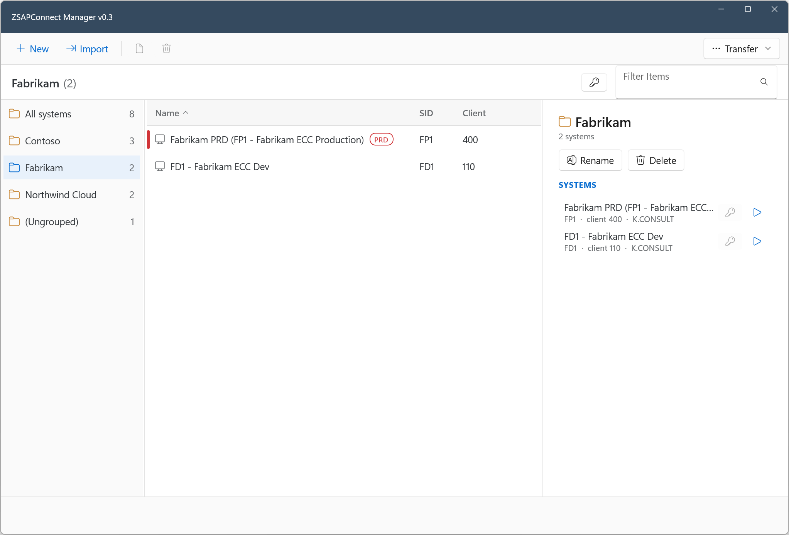
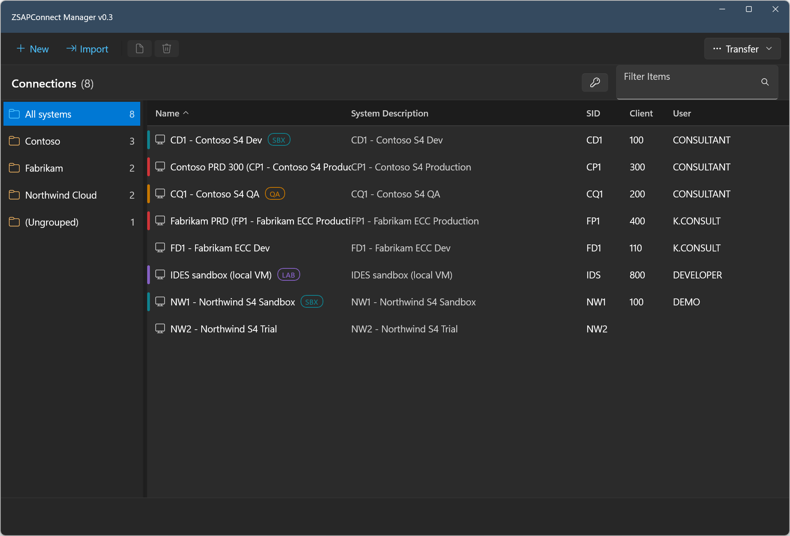

# ZSAPConnect Manager — Releases

Official download channel for **ZSAPConnect Manager**, a lightweight, native
Windows tool for SAP consultants who juggle many systems across many customers
— each with its own client, user, password, and VPN. Import your SAP Logon
landscape, keep per-system credentials in the Windows Credential Manager, and
log on with one click.

This repository hosts the release binaries only; the source code is currently
in a private repository (open-sourcing is under consideration).

*All screenshots show synthetic demo data.*

## Install

**Requirements:** Windows 10 version 1809 (build 17763) or later, x64.

From the [latest release](https://github.com/kts982/zsapconnect-releases/releases/latest):

- **`ZSAPConnect-Setup-X.Y.Z.exe`** (recommended, ~21 MB) — per-user installer,
  **no admin rights required**; adds a Start-menu shortcut and an uninstaller.
  Uninstalling keeps your entries and stored passwords, so upgrades are safe.
- **`ZSAPConnect-vX.Y.Z-win-x64.zip`** — portable: unzip anywhere and run
  `ZSAPConnect.App.exe`.

Both are self-contained — no .NET or Windows App SDK installation needed.

The binaries are currently unsigned, so Windows SmartScreen may show an
"unknown publisher" prompt on first run (**More info → Run anyway**).

## Features

- Import from SAP Logon (`SAPUILandscape.xml`) — direct application servers,
  load-balanced systems (message server + logon group), and SAProuter routes;
  re-importing preserves your customizations.
- One-click logon via SAP GUI Scripting (COM) when available, otherwise
  launch + auto-type into the new login window only.
- Per-system alias, client, user, logon language, VPN note, notes, groups,
  and color/label tags ("PRD", "SBX", …).
- SAP-compliant password generator; encrypted transfer bundles
  (AES-256-GCM) for moving entries and passwords to another PC.

## Screenshots

**Entry detail** — logon data, tag editor, production-notes callout, one-click Log On:

**Group page** — member overview with quick connect/copy, rename and delete:

**Windows skin** — follows the system Light/Dark theme (the default SAP GUI skin above keeps the familiar Belize look):

## Security & privacy

- Passwords are stored **only** in the Windows Credential Manager — never in
  files.
- All other data stays local in `%LOCALAPPDATA%\ZSAPConnect\`.
- Clipboard copies of credentials are excluded from clipboard history and
  cloud roaming, and auto-clear after 30 seconds.
- No telemetry. The app makes no network connections except to the SAP
  systems you connect to.

## Feedback

Bug reports and suggestions are welcome in
[Issues](https://github.com/kts982/zsapconnect-releases/issues).

## License

The binaries are free to use; see [LICENSE.txt](LICENSE.txt). Bundled
third-party components are listed in
[THIRD-PARTY-NOTICES.txt](THIRD-PARTY-NOTICES.txt).

---

*ZSAPConnect is an independent tool, not affiliated with, endorsed by, or
supported by SAP SE. SAP, SAP GUI and SAP Logon are registered trademarks of
SAP SE.*
